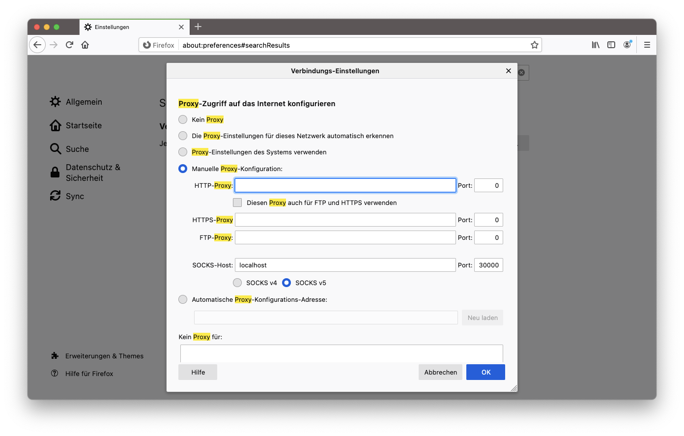
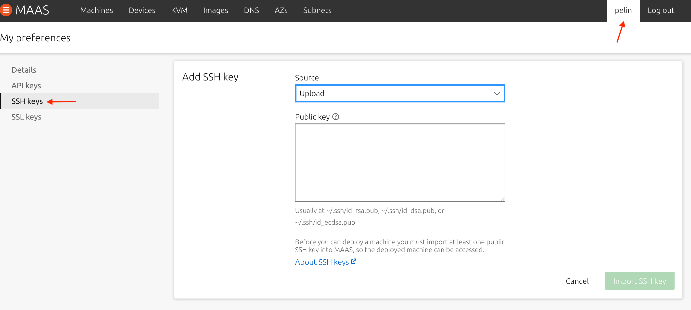
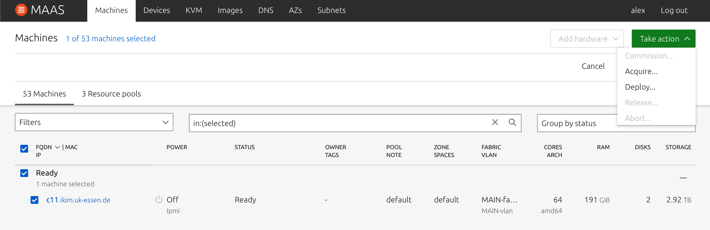
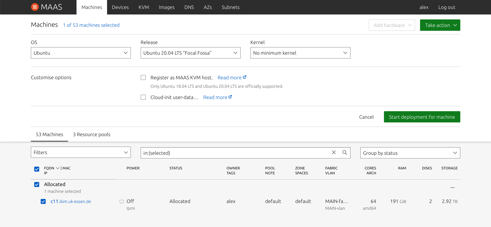
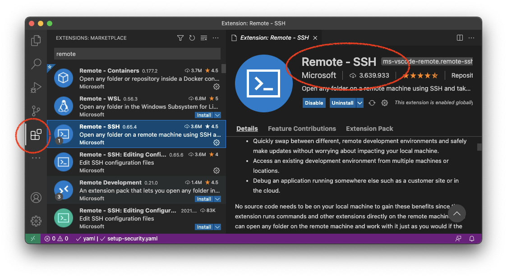
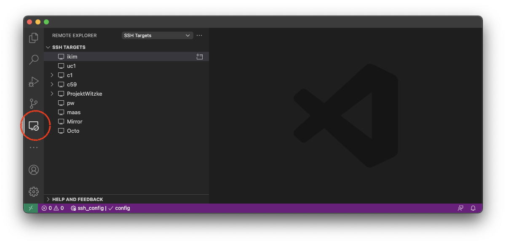
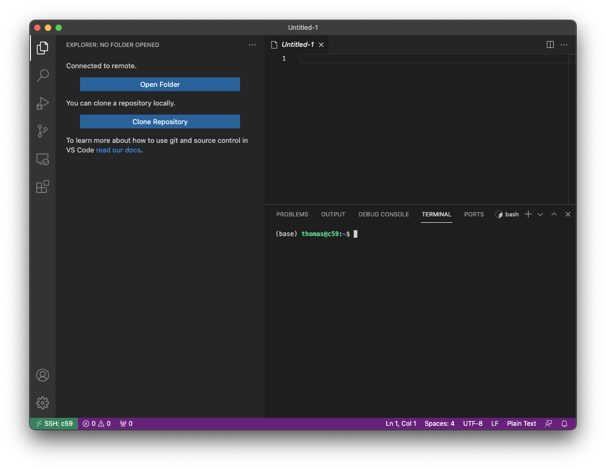

# Working on the IKIM Cluster

# Setting Up a Server

## What is SSH?

[SSH](http://en.wikipedia.org/wiki/Secure_Shell) or Secure Shell is a network communication protocol that enables two computers to communicate and share data. An inherent feature of SSH is that the communication between the two computers is encrypted meaning that it is suitable for use on insecure networks.

SSH is often used to "login" and perform operations on remote computers but it may also be used for transferring data. ([Source](https://www.ucl.ac.uk/isd/what-ssh-and-how-do-i-use-it))

## Set Up SSH

First, you have to generate public SSH key and edit your local SSH config file. On your own MacBook command line execute the following.

1. Generate a SSH Key Pair via

```bash
ssh-keygen -t rsa -b 4096
```

2. Create/open your local SSH config file with

```bash
nano ~/.ssh/config
```

and add the following to the config file. Make sure, you replace `$USERNAME` with your username (typically your first name).

```bash
Host *
  AddKeysToAgent yes
  IdentityFile ~/.ssh/id_rsa

Host ikim
  HostName login.ikim.uk-essen.de
  User $USERNAME
  ForwardAgent yes

Host g1-*.ikim.uk-essen c*.ikim.uk-essen.de 
  User $USERNAME
  ProxyCommand ssh -A ikim nc %h %p 2> /dev/null
  ForwardAgent yes

```

## Acquire a New Server via MAAS

[MAAS](https://maas.io/) stands for "metal as a service" and is a fast server provisioning for a data centre.

1. Ask your groups point of contact to add new user for you. Point of contacts of the groups are:
    - DS: Folker
    - TIO: Enrico
    - RB: Johannes
    - PNI: Jörg
2. Send the generated public key key to your point of contact. The public key ends with .pub and is usually located at `/home/username/.ssh/id_rsa` . Get your `$USERNAME` and `PASSWORD` from the point of contact.
3. Establish a SSH session on your local Terminal via

    ```bash
    ssh -D 30000 -N $USERNAME@login.ikim.uk-essen.de
    ```

4. Set the following proxy setting either on browser (e.g. Firefox), or MacBook settings
    - SOCKS Proxy
    - localhost:30000

    I'm recommending using Firefox (Settings → Proxy):

    

5. Open the MAAS interface by going to `10.240.136.5:5240` in your browser.
6. If logging in for the first time, you need to add your public SSH key. Click on your `USERNAME` (top right),  in the menu on the left choose `SSH keys` and click on the button `import SSH keys`. As the source, choose `Upload` and simply copy-paste your public key and click on import.

    

7. Go to "Machines" and choose an available machine. Click on "Take action" and then "Acquire" this machine.

    

8. Go to "Take action" and "Deploy" your machine.

    

## Set Up a New User

  1. Once deployed go back to your local command line and login to the remote machine as the user >>**ubuntu<<**:

```bash
ssh ubuntu@c$NUMBER.ikim.uk-essen.de
```

  2. Install ubuntu updates

```bash
sudo bash
apt-get update && apt-get upgrade
```

  3. Add yourself and other users. Place the SSH keys.

```bash
adduser $USERNAME
su - $USERNAME
mkdir ~/.ssh
nano ~/.ssh/authorized_keys
exit
```

## Mount Disk to /local

In case that the `/local` directory is not mounted, run the following. When executing `fdisk` choose the option **n,** then **enter (several times)** and then **w**:

```bash
fdisk /dev/sdb
mkfs.ext4 /dev/sdb1
mkdir /local
mount /dev/sdb1 /local
chmod 777 /local/
```

## Basic Installations via Ansible

[Ansible](https://docs.ansible.com/ansible/latest/index.html) is an open-source software provisioning, configuration management, and application-deployment tool enabling infrastructure as code. It runs on many Unix-like systems and can configure both Unix-like systems as well as Microsoft Windows. It includes its own declarative language to describe system configuration.

```bash
apt install ansible
```

It is necessary to install the first two of the following playbooks and roles via `ansible-playbooks PLAYBOOK`(e.g. `ansible-playbook setup-security.yaml`) while logged in as user `ubuntu`.

- [setup-security.yaml](playbooks/setup-security.yaml)

- [setup-ikim-server.yaml](playbooks/setup-ikim-server.yaml)

The following is are optional:

- [install-conda.yaml](playbooks/install-conda.yaml)

- [install-git-promt.yaml](playbooks/install-git-promt.yaml)

Alternativly, the playbooks can be install with the usage of the [inventory.ini](playbooks/inventory.ini). See ["How to build your inventory"](https://docs.ansible.com/ansible/latest/user_guide/intro_inventory.html) for more information.

## Configure the Proxy

In order to enable internet access on the compute nodes configure the proxy as follows:

```bash
export https_proxy=http://proxy.ikim.uk-essen.de:3128
export http_proxy=http://proxy.ikim.uk-essen.de:3128
export ftp_proxy=http://proxy.ikim.uk-essen.de:3128
```

Ideally this is placed in the `~/.bashrc` of user on the server.

**However, this is not necessary if the "setup" playbooks above are installed.**

## Add the Server to your SSH config

by adding the following to you local SSH config (`~/.ssh/config`).

```bash
Host c$NUMBER
  User $USERNAME
  ProxyCommand ssh -A ikim nc %h %p 2> /dev/null
  Hostname c$NUMBER.ikim.uk-essen.de
  ForwardAgent yes
```

# Working with VS Code

## Connecting via SSH

1. Download VS Code [https://code.visualstudio.com/](https://code.visualstudio.com/)
2. Download the extension "Remote - SSH" from Microsoft.



3. A new Remote Explorer icon should have appeared on the left side. If you click on it you will see all SSH connections that are stored in the SSH config file (`~/.ssh/config`).



4. By click on the folder symbol behind the name of a SSH target you can easily connect to it. A new window should pop up. Notice how the bottom left badge indications, that your are now on your server.



## Some other Extension

Here are some of the extension I like to use:

- Packages and frameworks:
    - [Docker](https://marketplace.visualstudio.com/items?itemName=ms-azuretools.vscode-docker)
    - [Snakemake Language](https://marketplace.visualstudio.com/items?itemName=Snakemake.snakemake-lang)
- Version control with git
    - [GitLens — Git supercharged](https://marketplace.visualstudio.com/items?itemName=eamodio.gitlens)
    - [GitHub Pull Requests and Issues](https://marketplace.visualstudio.com/items?itemName=GitHub.vscode-pull-request-github)
- Appearance
    - [GitHub Theme](https://marketplace.visualstudio.com/items?itemName=GitHub.github-vscode-theme)
    - [vscode-icons](https://marketplace.visualstudio.com/items?itemName=vscode-icons-team.vscode-icons)
- Quality of life:
    - [Bracket Pair Colorizer](https://marketplace.visualstudio.com/items?itemName=CoenraadS.bracket-pair-colorizer)
    - [Code Spell Checker](https://marketplace.visualstudio.com/items?itemName=streetsidesoftware.code-spell-checker)
    - [markdownlint](https://marketplace.visualstudio.com/items?itemName=DavidAnson.vscode-markdownlint)
    - [Prettier - Code formatter](https://marketplace.visualstudio.com/items?itemName=esbenp.prettier-vscode)
    - [Python Docstring Generator](https://marketplace.visualstudio.com/items?itemName=njpwerner.autodocstring)
    - [Rainbow CSV](https://marketplace.visualstudio.com/items?itemName=mechatroner.rainbow-csv)

# Contact

If you have any problem, just get in touch:

thomas.battenfeld@uk-essen.de

Mattermost: thomasbtf

Happy Coding 🚀